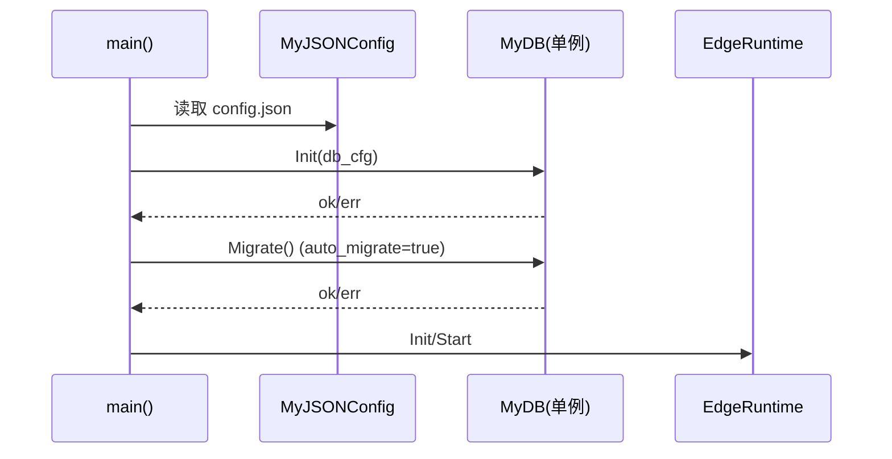
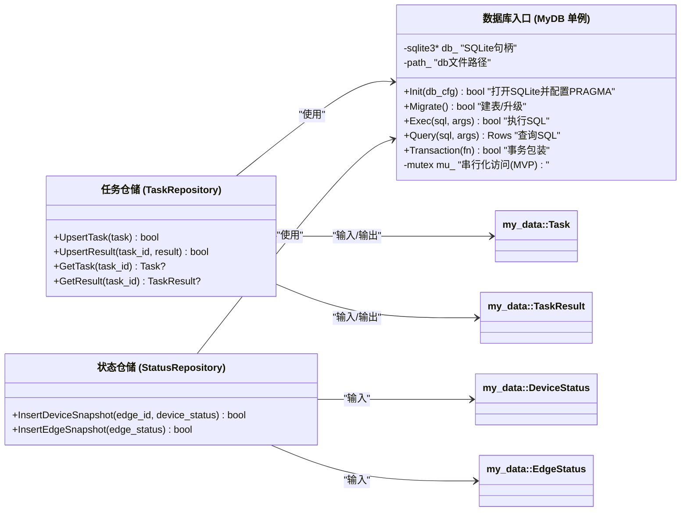

# my_db 模块设计文档（SQLite 单机版 / MVP：Task+TaskResult + 状态快照）

> 目标：在边缘端单机环境集成 SQLite 数据库模块，做到：
>
> 1) main 启动时自动初始化数据库（从 `config.json` 的 `db` 节点读取）
> 2) 数据库文件/表不存在则自动创建（schema migration）
> 3) 提供全局单例入口（但内部使用连接池思想/互斥保护）
> 4) 先落库：Task + TaskResult（最小闭环），并支持 DeviceStatus/EdgeStatus 快照存储
> 5) 保持与现有模块（my_data/my_control/my_device/my_edge）低耦合、易扩展
>
> 结论先行：
>
> - **可以做全局单例**，但推荐单例的是 **MyDB（数据库模块入口）**，而不是单个连接
> - “每张表全局单例”可以做成 Repository（TaskRepo/StatusRepo）单例，但不是必须；推荐仓储类持有 `MyDB&` 或通过 `MyDB::GetInstance()` 取连接

---

## 1. 为什么选择 SQLite（与你确认一致）

### 1.1 适用性

- 边缘端单机：零依赖、一个 `.db` 文件即可
- 自动建表简单：`CREATE TABLE IF NOT EXISTS ...`
- 便于打包与部署（相比 MySQL/Postgres 轻很多）

### 1.2 并发与性能注意点

- SQLite 并发写入能力有限（写锁），但对 MVP 足够：
  - Task/Result 写入频率：每任务一次
  - Status 快照：按周期（比如 1~5s）写
- 建议开启：
  - `PRAGMA journal_mode=WAL;`
  - `PRAGMA synchronous=NORMAL;`
  - `PRAGMA foreign_keys=ON;`
  - `PRAGMA busy_timeout=3000;`

---

## 2. 模块边界与职责划分

### 2.1 my_db 模块职责

- 初始化 SQLite（打开数据库文件）
- 执行 migration（建表/升级）
- 提供统一的执行/事务接口（Execute/Query）
- 提供 Repository（可选）：
  - `TaskRepository`：保存 Task + TaskResult
  - `StatusRepository`：保存 DeviceStatus/EdgeStatus 快照

### 2.2 my_db 不做什么

- 不做业务调度（那是 my_control/my_device/my_edge）
- 不做网络（API/MQTT 等）
- 不定义数据模型（使用 my_data 的 JSON 序列化）

---

## 3. 目录结构建议（与现有 my_db 目录对齐）

你当前 `src/util/my_db` 已存在但空壳。建议扩展为：

```
src/util/my_db
├─�� CMakeLists.txt
├── MyDB.h
├── MyDB.cpp
├── demo
│   ├── TaskRepository.h
│   ├── TaskRepository.cpp
│   ├── StatusRepository.h
│   └── StatusRepository.cpp
└── schema
    ├── Schema.h
    └── Schema.cpp
```

> 若你希望严格保持当前 3 个文件，也可以把 Repository/Schema 先写在 MyDB.* 中，但不推荐（会越来越大）。

---

## 4. 单例策略（你关心的重点）

### 4.1 推荐方案：MyDB 全局单例（线程安全）

`MyDB::GetInstance()` 是全局单例，负责：

- `Init(cfg)`：打开 db + 设置 pragma
- `Migrate()`：建表与版本升级
- `Exec/Query/Transaction`：统一入口

内部并发策略（MVP）：

- SQLite C API（sqlite3*）本身线程模式需注意：建议使用 **serialized**（默认一般是 threadsafe build）
- 为了最简单安全：
  - 在 MyDB 内部使用 `std::mutex` 序列化所有数据库操作（MVP）
  - 未来性能不够再升级为连接池/多连接（WAL 模式下仍要谨慎）

> 解释：
> SQLite 单连接 + 全局互斥在 MVP 阶段通常够用，最稳定，避免复杂的连接池/线程模式坑。

### 4.2 Repository 单例（可选）

可以做 `TaskRepository::GetInstance()`，但建议不要持有 sqlite3*，而是：

- 每次调用通过 `MyDB::GetInstance()` 执��� SQL
- Repository 只封装 SQL 与对象映射

---

## 5. 配置来源（config.json 的 db 节点）

建议 `config.json` 增加：

```json
{
  "db": {
    "enable": true,
    "type": "sqlite",
    "path": "/var/fast_cpp_server/data/edge.db",
    "busy_timeout_ms": 3000,
    "wal": true,
    "synchronous": "NORMAL",
    "auto_migrate": true,
    "status_snapshot_enable": true,
    "status_snapshot_interval_ms": 5000
  }
}
```

解释：

- `enable`：是否启用 DB（便于现场快速关闭）
- `path`：数据库文件路径（建议落到 /var/fast_cpp_server/data/）
- `auto_migrate`：启动自动建表/升级
- `status_snapshot_*`：控制状态快照写入频率（避免过量）

---

## 6. 启动流程（main 中自动启动）

### 6.1 推荐启动顺序

1) 读取 config.json（你已有 MyJSONConfig）
2) `MyDB::GetInstance().Init(db_cfg)`
3) 如果 `auto_migrate=true`：执行 `MyDB::GetInstance().Migrate()`
4) 启动 Edge/Device/Workflow
5) 在关键回调处写库（Task 完成、状态快照）

### 6.2 启动时序图



---

## 7. 表结构设计（MVP：Task + TaskResult + 状态快照）

### 7.1 schema_version（迁移版本表）

用于记录当前 schema 版本（整数）。

字段：

- `version INTEGER NOT NULL`

### 7.2 tasks（任务表）

目的：持久化 Task 基本信息（用于追���/审计/重放基础）

建议字段（尽量保持“可查询字段 + 原始 JSON”结合）：

- `task_id TEXT PRIMARY KEY`
- `command_id TEXT`
- `edge_id TEXT`
- `device_id TEXT`
- `capability TEXT`
- `action TEXT`
- `state INTEGER`
- `created_at_ms INTEGER`
- `deadline_at_ms INTEGER`
- `task_json TEXT`（完整 Task JSON，便于扩展字段而无需改表）
- 索引：
  - `(device_id, created_at_ms)`
  - `(command_id)`

### 7.3 task_results（任务结果表）

- `task_id TEXT PRIMARY KEY`（与 tasks 一对一）
- `code INTEGER`
- `message TEXT`
- `started_at_ms INTEGER`
- `finished_at_ms INTEGER`
- `result_json TEXT`（完整 TaskResult JSON）
- 外键：
  - `FOREIGN KEY(task_id) REFERENCES tasks(task_id) ON DELETE CASCADE`

### 7.4 device_status_snapshots（设备状态快照）

- `id INTEGER PRIMARY KEY AUTOINCREMENT`
- `edge_id TEXT`
- `device_id TEXT`
- `ts_ms INTEGER`
- `status_json TEXT`
- 索引：`(device_id, ts_ms)`

### 7.5 edge_status_snapshots（边缘状态快照）

- `id INTEGER PRIMARY KEY AUTOINCREMENT`
- `edge_id TEXT`
- `ts_ms INTEGER`
- `status_json TEXT`
- 索引：`(edge_id, ts_ms)`

---

## 8. 迁移策略（Auto Migrate）

### 8.1 MVP 版本策略

- schema_version 从 0 -> 1
- v1 创建上述 4 张业务表 + 1 张版本表

### 8.2 为什么不只用 CREATE IF NOT EXISTS

- 未来升级字段/索引时需要可控机制
- 使用 schema_version 可以做到：
  - v1 -> v2 添加索引/新增列
  - v2 -> v3 增加新表

---

## 9. 写库时机（与现有模块集成点）

### 9.1 Task/Result 写入（最推荐的落点）

在 `my_device` 的 `UpdateOnTaskFinish(task, result)` 或 `Workflow on_finish callback`：

- `TaskRepository::UpsertTask(task)`
- `TaskRepository::UpsertTaskResult(task.task_id, result)`
- 这保证每次任务完成一定落库

### 9.2 状态快照写入

两种方式（建议选第二种）：

1) 在 Edge 的 `GetStatusSnapshot()` 时写库（不推荐）

- 因为 GetStatus 可能被 API/heartbeat 高频调用，写库会放大 IO

2) 独立定时线程（推荐）

- 由 Edge 或单独的 DB 模块定时写：
  - 每 `status_snapshot_interval_ms` 获取一次 EdgeStatus
  - 写入 edge_status_snapshots
  - 同时写每个 device 的 DeviceStatus

---

## 10. 类图（含中文注释）



---

## 11. 单元测试建议（SQLite）

建议新增 gtest 用例：

- 使用临时路径：`/tmp/fast_cpp_server_test_edge.db`（每次测试前删除）
- 测试点：
  1) Init + Migrate 成功（表存在）
  2) UpsertTask + UpsertResult 后可查询回读
  3) 插入 DeviceStatus/EdgeStatus 快照后能查询到条数

---

## 12. 评审确认项（你确认后再编码）

1) 你希望 db 文件默认路径：
   - A `/var/fast_cpp_server/data/edge.db`（推荐生产）
   - B `./data/edge.db`（开发更方便）
2) status 快照写入方式：
   - A Edge 的定时线程（推荐）
   - B Heartbeat 线程中写（复用 heartbeat 线程，但耦合更高）
3) Task 落库策略：
   - A 任务入队时写 tasks（Submit 时写）
   - B 任务完成时写 tasks + results（推荐先做 B，最小闭环）

---

如果你确认以上 3 点，我下一步会按你项目风格开始编码 my_db：

- 实现 `MyDB`（sqlite3 C API，带 PRAGMA、Migrate、详细日志）
- 实现 `TaskRepository/StatusRepository`
- 在 main 中集成：从 `MyJSONConfig` 读取 `db` 节点并自动启动（不影响你其他模块）
- 新增 gtest：只跑 `MyDB_*` / `TaskRepo_*` 相关用例并可观察日志
