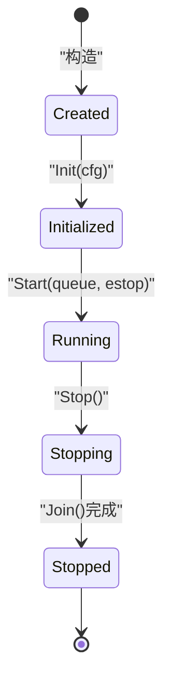
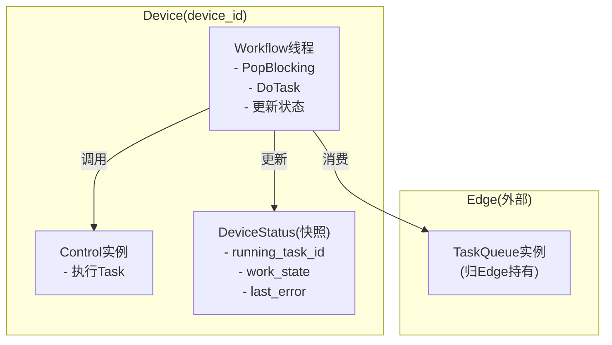
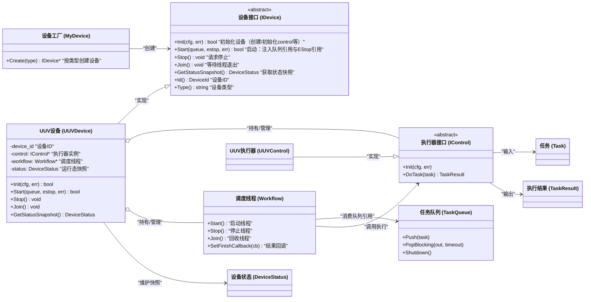
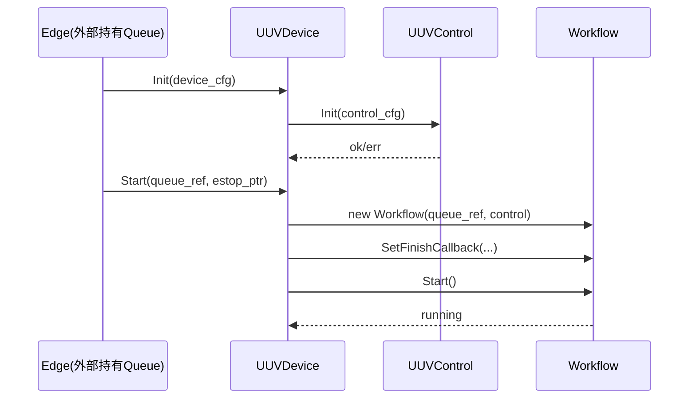
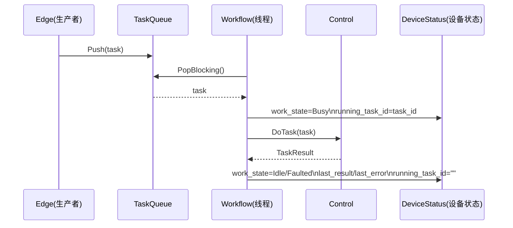

# my_device 模块设计文档（评审版：Device 作为每设备执行单元）

> 目标：基于已完成的 my_control（TaskQueue/Workflow/IControl/ICommandNormalizer 及 UUV demo），设计 my_device：
> 使其成为“每个 device_id 一套（workflow + control + 状态）”的执行单元，并与外部（Edge）通过 **队列引用** 进行解耦协作。
>
> 关键约束（已确认）：
>
> - **TaskQueue 实例在 Edge（外部）**，Device 仅拿引用供 Workflow 消费
> - 每个 device_id 对应一个 Device 实例
> - Device 必须维护运行态：当前执行任务、状态快照（用于上报/查询）
> - 日志要求高：所有关键状态流转点都要 `MYLOG_INFO/WARN/ERROR`

---

## 1. 模块定位与边界

### 1.1 my_device 的定位

my_device 模块负责定义“设备执行单元”的抽象与默认实现：

- **生命周期管理**：Init / Start / Stop / Join
- **绑定执行器与调度器**：持有 `IControl` 与 `Workflow`
- **状态维护**：维护并提供 `DeviceStatus` 快照（来自 my_data）
- **与 Edge 协作**：通过注入的 `TaskQueue&` 消费任务（Queue 实例不归 my_device）

### 1.2 my_device 不做什么（非职责）

- 不创建/持有 TaskQueue 实例（由 Edge 管）
- 不解析外部命令（Normalizer 在 my_control）
- 不做网络通信（mqtt/tcp/rest 在其他模块）
- 不做全局设备注册/路由（Edge 负责）

---

## 2. 总体运行模型（per-device 一套执行链）

每个 device_id 绑定一个 Device 实例，其内部包含：

- `IControl`：执行器（设备类型实现，如 UUVControl）
- `Workflow`：调度线程（消费 TaskQueue）
- `DeviceStatus + running_task`：运行态状态快照（线程安全）

> 注意：Workflow 类实现位于 `my_control/demo/Workflow.*`（你已确认保持这种结构）。

---

## 3. 目录结构与文件职责（逐文件说明）

你当前目录树：

```
src/util/my_device
├── CMakeLists.txt
├── demo
│   ├── UUVDevice.cpp
│   └── UUVDevice.h
├── IDevice.cpp
├── IDevice.h
├── MyDevice.cpp
└── MyDevice.h
```

### 3.1 `IDevice.h / IDevice.cpp`

**定位：设备执行单元接口（抽象）**

建议接口包含：

- `bool Init(const nlohmann::json& cfg, std::string* err)`
  - 解析设备级配置（device_id/type/control_cfg 等）
  - 创建/初始化内部 control（或由外部注入）
- `bool Start(my_control::TaskQueue& queue, std::atomic<bool>* estop, std::string* err)`
  - 注入队列引用 + estop 引用
  - 创建 workflow 并启动
- `void Stop()` / `void Join()`
  - 停止并回收线程（Stop 发出停止信号；Join 等待退出）
- `my_data::DeviceStatus GetStatusSnapshot() const`
  - 返回线程安全快照（含 queue_depth、running_task_id、conn/work 状态等）
- `my_data::DeviceId Id() const` / `std::string Type() const`
  - 便于外部管理与日志定位

> 为什么需要 IDevice：
> 后续会有多个设备类型（UUV/UAV/USV/…），Device 的“装配方式/状态字段/控制器”可能不同，接口能隔离差异。

---

### 3.2 `MyDevice.h / MyDevice.cpp`

**定位：Device 工厂/门面（轻量）**

MyDevice 模块建议提供一个统一入口来创建具体设备实例：

- `std::unique_ptr<IDevice> CreateDevice(const std::string& type);`
- 或者 `MyDevice::GetInstance().Create(type, cfg)` 之类

由于你现有目录里有 `MyDevice.*`，更符合“工厂/装配中心”的角色：

- 选择 `demo/UUVDevice` 或未来更多 Device 实现
- 调用 `device->Init(cfg)` 完成初始化

> 注意：这里仍然不持有 TaskQueue，队列在 Edge；MyDevice 只负责创建 Device。

---

### 3.3 `demo/UUVDevice.h / demo/UUVDevice.cpp`

**定位：UUV 设备执行单元实现（示例）**

UUVDevice 应当：

- 实现 `IDevice`
- 内部持有：
  - `std::unique_ptr<my_control::IControl> control_`（通常是 `my_control::demo::UUVControl`）
  - `std::unique_ptr<my_control::demo::Workflow> workflow_`
  - `my_data::DeviceStatus status_` + mutex
  - `std::optional<my_data::Task> running_task_snapshot_`（可选）+ mutex
- 在 Workflow 回调中更新状态：
  - Pop 到任务时：Busy + running_task_id
  - 执行结束：Idle/Faulted + last_error/last_result + last_task_at_ms
- 由外部注入 queue 与 estop：
  - `Start(queue, &estop_flag)`

---

### 3.4 `CMakeLists.txt`

**定位：构建 my_device 静态库**

依赖关系建议：

- `my_device` 依赖：`my_control`、`my_data`、`mylog`、`myconfig`、`pthread`
- include path：`${PROJECT_SOURCE_DIR}/src/util/my_device`

---

## 4. Device 状态模型（DeviceStatus 的推荐用法）

my_data 中的 `DeviceStatus` 字段已经比较丰富，本模块建议这样维护：

### 4.1 必维护字段（MVP）

- `device_id`
- `conn_state`：Online/Offline/Unknown
  - MVP 可先固定 Online，后续接 my_network/device_online_monitor 再动态更新
- `work_state`：Idle/Busy/Faulted
- `running_task_id`
- `last_task_at_ms`
- `last_seen_at_ms`（可用于心跳/在线判定）
- `last_error`
- `queue_depth`：由 Edge 在聚合状态时填充，或 Device 在 GetStatusSnapshot 时调用 `queue.Size()`（二选一）

### 4.2 状态写入策略（强建议）

- **只允许 Workflow 线程写执行相关状态**（running_task/work_state/last_result）
- `GetStatusSnapshot()` 返回拷贝，避免外部拿到引用造成竞态

---

## 5. 生命周期与线程模型

### 5.1 生命周期状态机（建议）



### 5.2 线程模型（每 Device 一个 Workflow 线程）



---

## 6. 与 my_control 的交互契约（关键）

### 6.1 Workflow 依赖注入

UUVDevice 在 Start 时组装 Workflow：

- `Workflow(name, queue_ref, *control_)`
- `workflow->SetEStopFlag(estop_ptr)`
- `workflow->SetFinishCallback(...)`：在此回调中更新 DeviceStatus

### 6.2 Stop/Join 与 queue shutdown

因为 queue 实例在 Edge：

- Device.Stop()：只发 stop 信号（Workflow 内用短超时 pop 轮询 stop）
- 推荐：Edge 在系统 shutdown 时对所有 queue 调用 `Shutdown()`，保证 Workflow 能快速退出
- 若仅停止单个 device，Edge 可选择只 shutdown 对应 queue

---

## 7. 类关系图（含中文注释）



---

## 8. 关键时序图（含中文注释）

### 8.1 启动时序：Init + Start



### 8.2 执行时序：队列消费 -> 执行 -> 更新状态



---

## 9. 日志规范（建议）

为保证“可观测性”，建议 my_device 日志至少覆盖：

- Init：
  - `[Device:{id}] Init 开始/成功/失败`
  - `[Device:{id}] control.Init ...`
- Start：
  - `[Device:{id}] Start 注入 queue={name} estop_ptr=...`
  - `[Device:{id}] Workflow 已启动`
- 执行态变更（在回调或 Workflow hooks 中）：
  - Busy/Idle/Faulted 切换
  - running_task_id 设置/清空
  - last_error 更新
- Stop/Join：
  - `[Device:{id}] Stop 请求`
  - `[Device:{id}] Join 完成`

---

## 10. 评审检查清单（你可以先确认）

1) IDevice 的 Start 是否必须传 `TaskQueue&`（是，队列实例归 Edge）
2) Device 是否维护 running_task_id / work_state（是，建议）
3) queue_depth 是由 Edge 统一填，还是 Device 在 GetStatusSnapshot 里读取 queue.Size？（二选一，建议 Edge 统一聚合更纯）
4) Stop/Join 退出是否依赖 queue.Shutdown（建议由 Edge 在全局 shutdown 时统一 shutdown 队列）

---

如果你确认这份 my_device 设计没问题，下一步我会按你的目录树开始编码（方式1：逐文件贴内容），并新增对应的 gtest 用例到：
`test/util/my_device/demo/`（或你指定的位置），测试会覆盖：

- UUVDevice Init/Start/Stop/状态更新基本行为
- 与 my_control 的 Workflow + TaskQueue 联动执行一条任务
