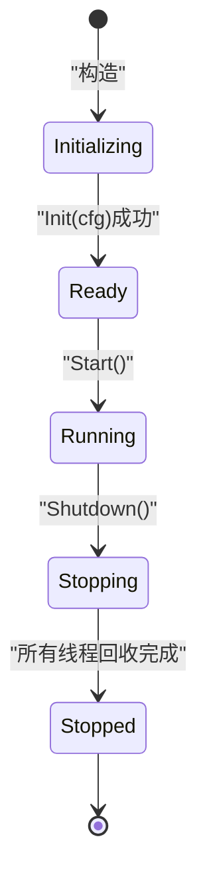
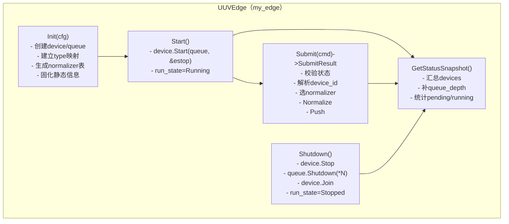
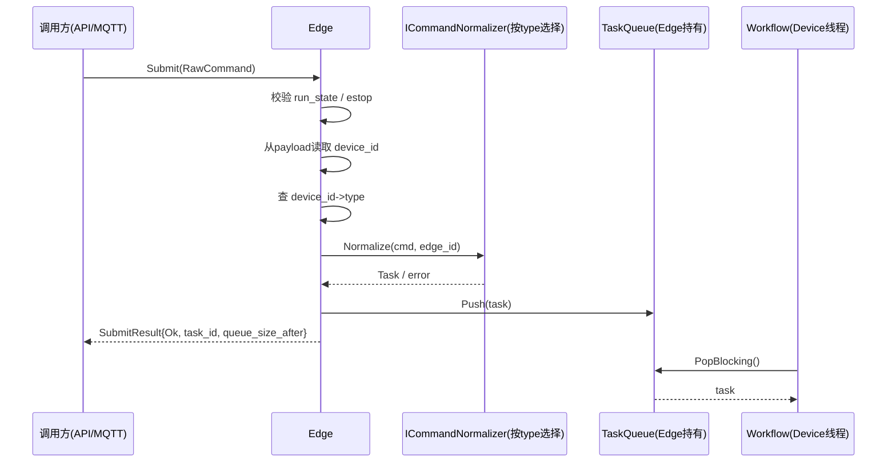
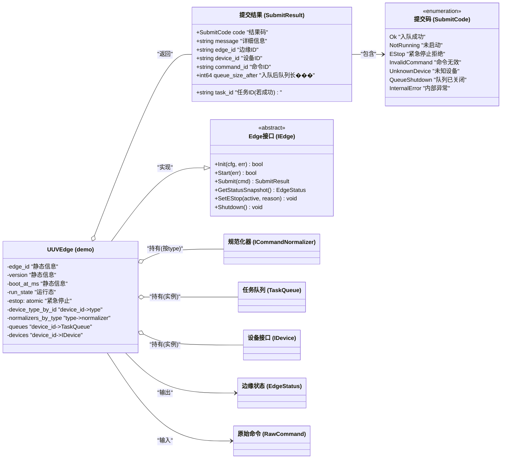

# my_edge 模块设计文档（评审版 v2：Init/Start 分离 + 多类型 Normalizer + SubmitResult）

> 本文基于你确认的总体架构：  
> **Edge 持有队列实例**、**Device 每设备一套（Workflow+Control）**、**Normalizer/Control 来自 my_control**、**状态由 my_data 承载**。  
>
> 重点更新：
> 1) `Init(cfg)` 与 `Start()` 分离（生命周期更清晰）  
> 2) Normalizer 采用 `ICommandNormalizer` 泛化：按设备类型自动创建/复用  
> 3) `Submit()` 返回 `SubmitResult`（枚举 + 详细信息）  
> 4) `GetStatusSnapshot()` 固化 cfg 中静态信息（edge_id/version/boot_time 等）

---

## 1. 模块定位与边界

### 1.1 my_edge 是什么
my_edge 是单进程内的“边缘控制运行时（Edge Runtime）”容器，负责：
- **装配**：根据 cfg 创建 devices 与 queues
- **启动/停止**：启动每个 device 的 workflow；统一 shutdown 队列
- **命令入口与路由**：RawCommand -> Normalize -> 入队到对应 device 队列
- **状态汇总**：EdgeStatus（补 queue_depth/pending/running 等）

### 1.2 my_edge 不负责
- 网络接入（MQTT/TCP/REST）
- 任务执行（执行在 Device->Workflow->Control）
- 数据类定义（在 my_data）
- 命令格式定义（Normalizer 在 my_control）

---

## 2. 目录结构与文件职责

```
src/util/my_edge
├── CMakeLists.txt
├── demo
│   ├── UUVEdge.cpp
│   └── UUVEdge.h
├── IEdge.h
├── MyEdge.cpp
└── MyEdge.h
```

### 2.1 `IEdge.h`
定义 Edge 的抽象接口，包括：
- `Init(cfg)`：只装配，不启动线程
- `Start()`：启动所有 device/workflow
- `Submit(cmd)`：返回 SubmitResult（结构化结果）
- `GetStatusSnapshot()`：返回 EdgeStatus（含静态信息+动态信息）
- `SetEStop(active, reason)`：设置紧急停止
- `Shutdown()`：停止 devices + shutdown queues + join + 清理

### 2.2 `MyEdge.h/.cpp`
工厂/门面：`Create(type)` 返回不同 demo Edge 实现（如 UUVEdge）

### 2.3 `demo/UUVEdge.h/.cpp`
demo Edge 实现：真正包含队列/设备映射、normalizer 注册表、状态汇总逻辑。

---

## 3. 生命周期设计：Init/Start 分离

### 3.1 状态机（EdgeRunState）
建议在 my_edge 内部维护一个简单状态枚举（可用 my_data::EdgeRunState，也可内部定义）：

- Initializing：构造后默认
- Ready：Init 成功但未 Start
- Running：Start 成功，workflow 正在消费
- Stopping：Shutdown 进行中
- Stopped：Shutdown 完成



### 3.2 Init 与 Start 分离的语义
- `Init(cfg)`：创建 queues 与 devices，完成 device.Init，但不启动 workflow
- `Start()`：逐 device 注入 queue 引用与 estop 引用，启动 workflow
- `Submit()` 在不同状态下的策略（建议）：
  - Ready：允许入队（但不消费）或直接拒绝（建议：**拒绝**，返回 NotRunning，避免队列积压不知情）
  - Running：正常 Normalize + Push
  - Stopping/Stopped：拒绝

> 建议：默认 **NotRunning = 禁止 Submit**，以减少“启动顺序错误”的隐性风险。

---

## 4. Normalizer 策略：按 type 注册与复用（泛化）

### 4.1 为什么不“全 Edge 一个 normalizer”
因为未来你会有多设备类型，不同 payload 规则可能不同。  
最可扩展又不复杂的方式：**按 device type 创建 normalizer 并复用**。

### 4.2 数据结构建议
- `device_type_by_id_ : map<DeviceId, string type>`
- `normalizers_by_type_ : map<string type, unique_ptr<ICommandNormalizer>>`

### 4.3 Submit 时如何选择 normalizer
- Step1：从 RawCommand.payload 顶层读取 `device_id`（约定必有）
- Step2：查 `device_type_by_id_[device_id]`
- Step3：取 `normalizers_by_type_[type]`
- Step4：调用 `Normalize(cmd, edge_id)` 得到 Task
- Step5：Push 到 `queues_[device_id]`

---

## 5. SubmitResult：结构化返回（替代 bool）

### 5.1 SubmitCode 枚举（建议）
```text
Ok              入队成功（不代表执行成功）
NotRunning      Edge 未 Start，拒绝入队
EStop           Edge 处于 EStop，拒绝入队（或可配置允许入队）
InvalidCommand  Normalize 失败（字段缺失/格式不对）
UnknownDevice   device_id 不存在或未注册
QueueShutdown   对应队列已 shutdown（通常是 shutdown 过程中）
InternalError   未知异常
```

### 5.2 SubmitResult 数据结构（建议字段）
- `code`：SubmitCode
- `message`：中文/英文错误信息（用于 API 返回与日志对齐）
- `edge_id`：便于追踪
- `device_id`：解析得到的 device_id（若可得）
- `command_id`：原始 command_id（若有）
- `task_id`：Normalize 成功后生成的 task_id（若成功）
- `queue_size_after`：入队后队列长度（可选，便于观测）

> 说明：SubmitResult 的 `task_id` 能让上层实现“异步查询任务状态”的链路（后续扩展）。

---

## 6. GetStatusSnapshot：静态信息固化 + 动态信息汇总

### 6.1 静态信息（Init 时固化）
- `edge_id`
- `version`（cfg 中读取；或默认）
- `boot_at_ms`（Init 时记录）

### 6.2 动态信息（实时计算）
- `run_state`（Ready/Running/EStop/Stopping）
- `estop_active/estop_reason`
- `devices`：
  - `DeviceStatus = device->GetStatusSnapshot()`
  - `queue_depth = queues_[id]->Size()`（Edge 聚合填充）
- `tasks_pending_total = sum(queue.size)`
- `tasks_running_total = count(device.work_state == Busy)`

---

## 7. 并发与锁设计（shared_mutex 推荐）

### 7.1 并发场景
- Submit：高频，可能多线程
- GetStatus：高频
- Init/Start/Shutdown：低频

### 7.2 锁策略
- `std::shared_mutex rw_mutex_`
  - Submit/GetStatus：shared_lock
  - Init/Start/Shutdown：unique_lock
- queues 本身线程安全；rw_mutex 仅保护 map 结构与指针生命周期

---

## 8. 关键设计图（Mermaid，含中文注释）

### 8.1 组件协作图（新版：Init/Start 分离 + SubmitResult）



### 8.2 Submit 时序（选择 normalizer + 返回 SubmitResult）



### 8.3 类图（含中文注释 + SubmitResult）



---

## 9. 评审确认项（请你确认）

1) `Init(cfg)` 与 `Start()` 分离后：Submit 在 Ready 状态是“拒绝（NotRunning）”还是“允许入队但不消费”？  
   - 建议：拒绝（减少隐性积压）
2) EStop 策略：EStop=true 时 Submit 是拒绝（EStop）还是允许入队但不执行？  
   - 建议：默认拒绝；但可配置允许入队
3) Normalizer 选择依据：payload 顶层是否强制包含 device_id？  
   - 建议：是（否则路由困难）
4) version 来源：cfg 提供，若无则默认 `"0.1.0"`

确认完毕后，我将按你的目录树开始贴 `my_edge` 代码，并新增 gtest 到 `test/util/my_edge/demo/`，覆盖：
- Init/Start 分离行为
- SubmitResult 的各种 code 分支（UnknownDevice/InvalidCommand/NotRunning/EStop）
- Running 状态下 Submit 入队并被 device 执行（联动 my_device/my_control）
- Shutdown 统一 shutdown 队列唤醒 workflow 并回收线程