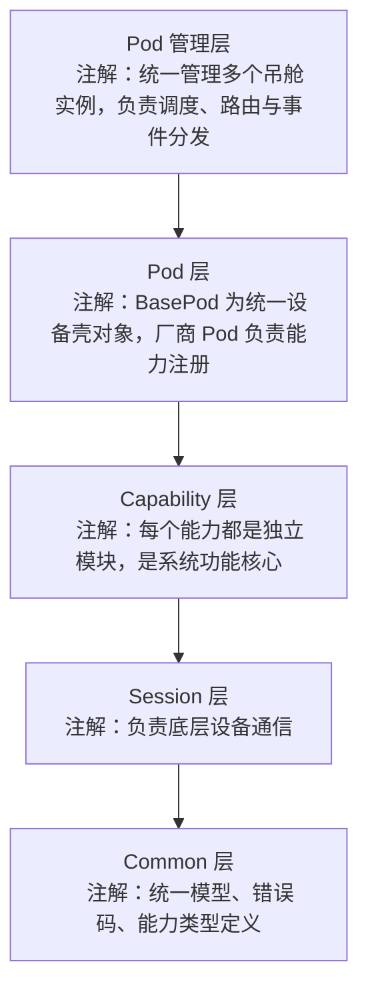
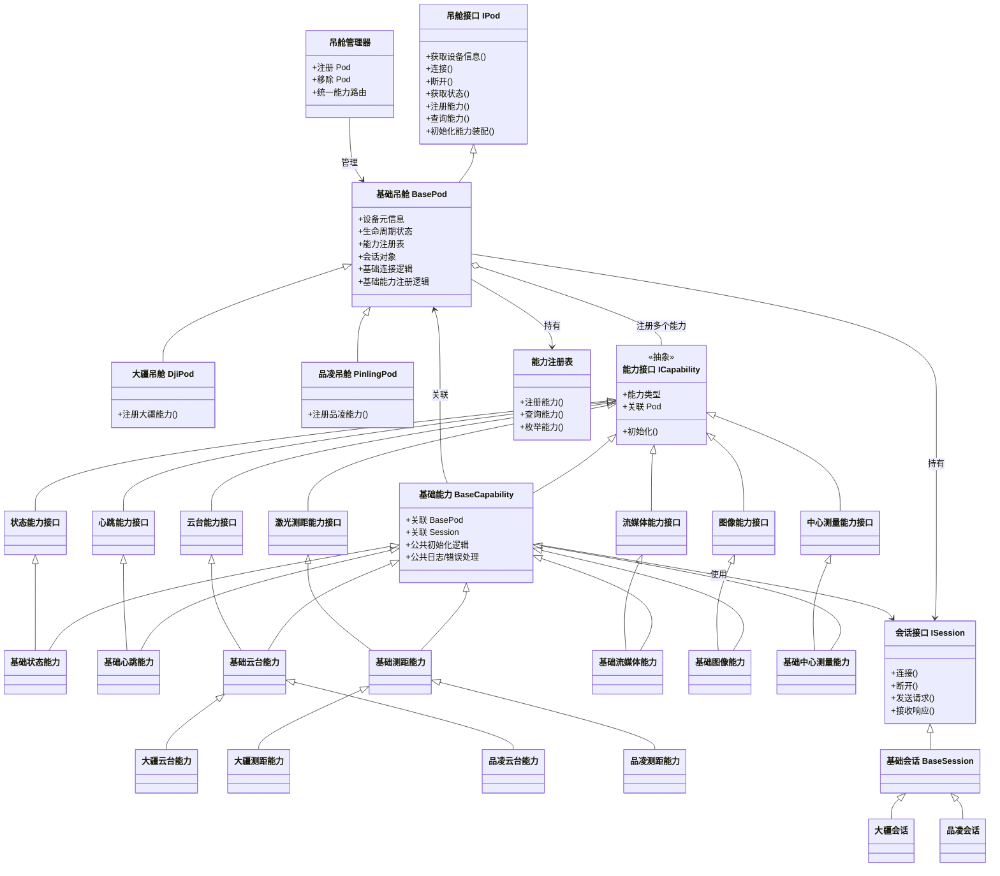

请帮我实现一个 **C++ 吊舱连接模块（Pod Connection Module）** 的基础工程代码框架。
要求重点放在 **架构骨架、类关系、接口设计、能力注册机制、目录结构**，中文注释, 中文日志,设计文档,单元测试

---

## 一、实现目的

我要实现一个 **吊舱管理模块**，用于对接多种厂商吊舱设备。该模块需要支持以下能力：

- 吊舱连接与断开
- 心跳检测
- 云台控制（PTZ）
- 拉流管理
- 图像抓拍
- 激光测距
- 中心点测量（测量画面中心位置目标到激光仪的距离）
- 多厂商扩展能力接入

该模块的核心目标是：

1. **统一抽象多厂商吊舱**
2. **将一个大的 BasePod 拆成轻量 BasePod + 多个 Capability 能力类**
3. **通过能力注册机制，把各厂商支持的能力装配到 BasePod 上**
4. **让 vendor 层尽量轻，核心功能更多沉淀在 capability 层**
5. **便于后续扩展更多厂商和更多能力**

---

## 二、设计思想

请严格按照下面的架构思路实现：

### 1. BasePod 保留，但要做“轻量设备壳对象”

BasePod 只负责：

- 设备基础信息
- 生命周期管理（connect / disconnect）
- 状态缓存
- Session 持有
- Capability 注册与查询
- 初始化时装配能力

BasePod **不要做大而全业务实现**。
PTZ、测距、流媒体、图像、中心测量等都不要直接堆在 BasePod 里。

---

### 2. Capability 是核心扩展点

每种能力都应该单独建模，形成自己的体系。每类 capability 包括三层：

- `interface`：能力接口定义
- `base`：能力基础实现
- `vendor`：厂商具体实现

例如：

- `IStatusCapability` -> `BaseStatusCapability` -> `DjiStatusCapability`
- `IPtzCapability` -> `BasePtzCapability` -> `PinlingPtzCapability`

---

### 3. Vendor Pod 要尽量轻

例如：

- `DjiPod`
- `PinlingPod`

它们主要只做：

- 继承 `BasePod`
- 初始化自己的 `Session`
- 注册自己支持的 capability
- 完成 capability 装配

不要把大量厂商业务逻辑写进 `DjiPod` / `PinlingPod` 本体中。

---

### 4. 通过 CapabilityRegistry 管理能力

BasePod 内部不要直接用很多散乱成员保存能力对象。请设计一个 **CapabilityRegistry**，负责：

- 注册 capability
- 查询 capability
- 判断 capability 是否存在
- 列举 capability

---

### 5. Session 单独抽象

Capability 不直接实现网络细节，而是依赖 Session：

- `ISession`
- `BaseSession`
- `DjiSession`
- `PinlingSession`

---

### 6. PodManager 负责统一管理

请实现一个 `PodManager`，负责：

- 注册 Pod
- 查询 Pod
- 移除 Pod
- 后续统一路由能力调用

当前阶段重点实现基础框架即可。

---

## 三、模块描述

本模块是一个 **多厂商吊舱接入基础框架**，目标是形成一个清晰、可扩展、可维护的设备接入层。

### 模块主要组成：

1. **common**

   - 基础模型、枚举、错误码、结果结构、能力类型
2. **pod**

   - IPod
   - BasePod
   - Vendor Pod（如 DjiPod / PinlingPod）
3. **capability**

   - 能力接口层
   - 能力基础实现层
   - 厂商能力实现层
4. **session**

   - 会话接口层
   - 会话基础实现层
   - 厂商会话实现层
5. **registry**

   - PodRegistry
   - CapabilityRegistry
6. **manager**

   - PodManager
   - 可保留 PodScheduler / PodEventDispatcher 的骨架类

---

## 四、模块结构与功能说明

### 1. common

需要提供统一的基础定义，包括但不限于：

- PodVendor
- PodState
- CapabilityType
- StreamType
- PTZPose
- PodInfo
- PodStatus
- LaserInfo
- StreamInfo
- ImageFrame
- CenterMeasurementResult
- PodResult
- PodErrorCode

---

### 2. pod/interface

定义 `IPod`，它应该是吊舱的统一抽象接口。建议包含以下职责：

- 获取设备基础信息
- connect / disconnect
- isConnected / state
- capability 注册
- capability 查询
- session 设置 / 获取
- 初始化 capability 装配入口

---

### 3. pod/base

定义 `BasePod`，作为 `IPod` 的基础实现。职责包括：

- 保存 `PodInfo`
- 保存当前 `PodState`
- 持有 `ISession`
- 持有 `CapabilityRegistry`
- 提供基础 connect / disconnect
- 提供 capability 注册 / 获取
- 提供基础初始化装配逻辑框架

---

### 4. pod/vendor

先实现两个示例厂商：

- `DjiPod`
- `PinlingPod`

要求：

- 继承 `BasePod`
- 初始化自己的 Session
- 注册自己支持的 capability
- 至少注册：
  - 状态能力
  - 心跳能力
  - PTZ 能力
  - 激光能力
  - 流媒体能力
  - 图像能力
  - 中心点测量能力

其中厂商实现先以“占位/示例逻辑”为主，不要求真实协议。

---

### 5. capability/interface

定义能力接口：

- `ICapability`
- `IStatusCapability`
- `IHeartbeatCapability`
- `IPtzCapability`
- `ILaserCapability`
- `IStreamCapability`
- `IImageCapability`
- `ICenterMeasureCapability`

---

### 6. capability/base

定义能力基础类：

- `BaseCapability`
- `BaseStatusCapability`
- `BaseHeartbeatCapability`
- `BasePtzCapability`
- `BaseLaserCapability`
- `BaseStreamCapability`
- `BaseImageCapability`
- `BaseCenterMeasureCapability`

要求：

- BaseCapability 持有 `BasePod` 或 `IPod` 引用/指针
- BaseCapability 持有 `ISession` 引用/指针
- 提供通用初始化逻辑
- 提供通用日志/错误处理框架（可先做占位）

---

### 7. capability/vendor

请至少实现：

#### dji

- DjiStatusCapability
- DjiHeartbeatCapability
- DjiPtzCapability
- DjiLaserCapability
- DjiStreamCapability
- DjiImageCapability
- DjiCenterMeasureCapability

#### pinling

- PinlingStatusCapability
- PinlingHeartbeatCapability
- PinlingPtzCapability
- PinlingLaserCapability
- PinlingStreamCapability
- PinlingImageCapability
- PinlingCenterMeasureCapability

这些实现可以先返回 mock / placeholder 数据，但类结构要完整。

---

### 8. session

请实现：

#### interface

- `ISession`

#### base

- `BaseSession`

#### vendor

- `DjiSession`
- `PinlingSession`

要求：

- 提供 connect / disconnect
- 提供 sendRequest / receiveResponse 或 request 接口
- 允许后续协议扩展
- 当前阶段可以只做占位实现

---

### 9. registry

请实现：

#### CapabilityRegistry

职责：

- 注册 capability
- 通过 `CapabilityType` 查询 capability
- 支持模板方式查询具体能力接口
- 判断 capability 是否存在
- 列出全部 capability

#### PodRegistry

职责：

- 注册 Pod
- 删除 Pod
- 查询 Pod
- 列出所有 Pod

---

### 10. manager

请实现：

- `PodManager`
- `PodScheduler`（骨架）
- `PodEventDispatcher`（骨架）

其中 `PodManager` 至少支持：

- addPod
- removePod
- getPod
- listPods

---

## 五、总体结构图（Mermaid）

请按下面架构实现：



以及这个 UML 关系思路：



---

## 六、目录树要求

请严格按下面目录结构创建代码文件。
要求：**`.h` 和 `.cpp` 放在同一个文件夹下`**。

```text
pod_connection_module/
├── CMakeLists.txt
├── README.md
├── docs/
│   └── pod_connection_design.md
├── src/
│   ├── common/
│   │   ├── pod_types.h
│   │   ├── pod_types.cpp
│   │   ├── pod_models.h
│   │   ├── pod_models.cpp
│   │   ├── pod_result.h
│   │   ├── pod_result.cpp
│   │   ├── pod_errors.h
│   │   ├── pod_errors.cpp
│   │   ├── capability_types.h
│   │   └── capability_types.cpp
│   │
│   ├── pod/
│   │   ├── interface/
│   │   │   ├── i_pod.h
│   │   │   └── i_pod.cpp
│   │   ├── base/
│   │   │   ├── base_pod.h
│   │   │   └── base_pod.cpp
│   │   ├── dji/
│   │   │   ├── dji_pod.h
│   │   │   └── dji_pod.cpp
│   │   └── pinling/
│   │       ├── pinling_pod.h
│   │       └── pinling_pod.cpp
│   │
│   ├── capability/
│   │   ├── interface/
│   │   │   ├── i_capability.h
│   │   │   ├── i_status_capability.h
│   │   │   ├── i_heartbeat_capability.h
│   │   │   ├── i_ptz_capability.h
│   │   │   ├── i_laser_capability.h
│   │   │   ├── i_stream_capability.h
│   │   │   ├── i_image_capability.h
│   │   │   ├── i_center_measure_capability.h
│   │   │   └── i_capability.cpp
│   │   ├── base/
│   │   │   ├── base_capability.h
│   │   │   ├── base_capability.cpp
│   │   │   ├── base_status_capability.h
│   │   │   ├── base_status_capability.cpp
│   │   │   ├── base_heartbeat_capability.h
│   │   │   ├── base_heartbeat_capability.cpp
│   │   │   ├── base_ptz_capability.h
│   │   │   ├── base_ptz_capability.cpp
│   │   │   ├── base_laser_capability.h
│   │   │   ├── base_laser_capability.cpp
│   │   │   ├── base_stream_capability.h
│   │   │   ├── base_stream_capability.cpp
│   │   │   ├── base_image_capability.h
│   │   │   ├── base_image_capability.cpp
│   │   │   ├── base_center_measure_capability.h
│   │   │   └── base_center_measure_capability.cpp
│   │   ├── dji/
│   │   │   ├── dji_status_capability.h
│   │   │   ├── dji_status_capability.cpp
│   │   │   ├── dji_heartbeat_capability.h
│   │   │   ├── dji_heartbeat_capability.cpp
│   │   │   ├── dji_ptz_capability.h
│   │   │   ├── dji_ptz_capability.cpp
│   │   │   ├── dji_laser_capability.h
│   │   │   ├── dji_laser_capability.cpp
│   │   │   ├── dji_stream_capability.h
│   │   │   ├── dji_stream_capability.cpp
│   │   │   ├── dji_image_capability.h
│   │   │   ├── dji_image_capability.cpp
│   │   │   ├── dji_center_measure_capability.h
│   │   │   └── dji_center_measure_capability.cpp
│   │   └── pinling/
│   │       ├── pinling_status_capability.h
│   │       ├── pinling_status_capability.cpp
│   │       ├── pinling_heartbeat_capability.h
│   │       ├── pinling_heartbeat_capability.cpp
│   │       ├── pinling_ptz_capability.h
│   │       ├── pinling_ptz_capability.cpp
│   │       ├── pinling_laser_capability.h
│   │       ├── pinling_laser_capability.cpp
│   │       ├── pinling_stream_capability.h
│   │       ├── pinling_stream_capability.cpp
│   │       ├── pinling_image_capability.h
│   │       ├── pinling_image_capability.cpp
│   │       ├── pinling_center_measure_capability.h
│   │       └── pinling_center_measure_capability.cpp
│   │
│   ├── session/
│   │   ├── interface/
│   │   │   ├── i_session.h
│   │   │   └── i_session.cpp
│   │   ├── base/
│   │   │   ├── base_session.h
│   │   │   └── base_session.cpp
│   │   ├── dji/
│   │   │   ├── dji_session.h
│   │   │   └── dji_session.cpp
│   │   └── pinling/
│   │       ├── pinling_session.h
│   │       └── pinling_session.cpp
│   │
│   ├── registry/
│   │   ├── pod_registry.h
│   │   ├── pod_registry.cpp
│   │   ├── capability_registry.h
│   │   └── capability_registry.cpp
│   │
│   ├── manager/
│   │   ├── pod_manager.h
│   │   ├── pod_manager.cpp
│   │   ├── pod_scheduler.h
│   │   ├── pod_scheduler.cpp
│   │   ├── pod_event_dispatcher.h
│   │   └── pod_event_dispatcher.cpp
│   │
│   └── utils/
│       ├── log_utils.h
│       ├── log_utils.cpp
│       ├── time_utils.h
│       ├── time_utils.cpp
│       ├── string_utils.h
│       └── string_utils.cpp

```

---

## 七、实现要求

请按照以下要求生成代码：

1. 使用 **C++17 或以上**
2. 先实现**完整框架代码**，允许大量占位逻辑
3. 所有类、接口、头文件、源文件都要创建出来
4. 保证命名统一、依赖关系清晰
5. 不要求真实协议实现，但要求架构完整
6. 优先保证：
   - 可编译
   - 类关系正确
   - 接口可扩展
   - BasePod + CapabilityRegistry + BaseCapability 机制完整
7. 给出必要的 `CMakeLists.txt`
8. 给出一个简单的 `README.md`
9. 可以附带单元测试

---

## 八、额外注意事项

1. vendor 内部请尽量轻量化
2. capability 层请写得完整一些
3. BaseCapability 一定要存在
4. CapabilityRegistry 一定要存在
5. 不要回退成“大而全 BasePod”设计
6. 目录组织必须符合上面的树
7. 如果某些 `.cpp` 只包含空实现，也请保留
8. 代码风格保持统一、清晰、工程化

---

## 九、你最终需要输出的内容

请直接生成：

1. 完整目录结构下的代码文件内容
2. 代码要有大量的中文注释,中文日志.依赖MYLOG模块
3. `CMakeLists.txt`
4. `README.md`
5. 如有必要，附一个简单 使用手册

目标是让我可以直接把这些文件落盘，作为后续开发的基础工程骨架。
