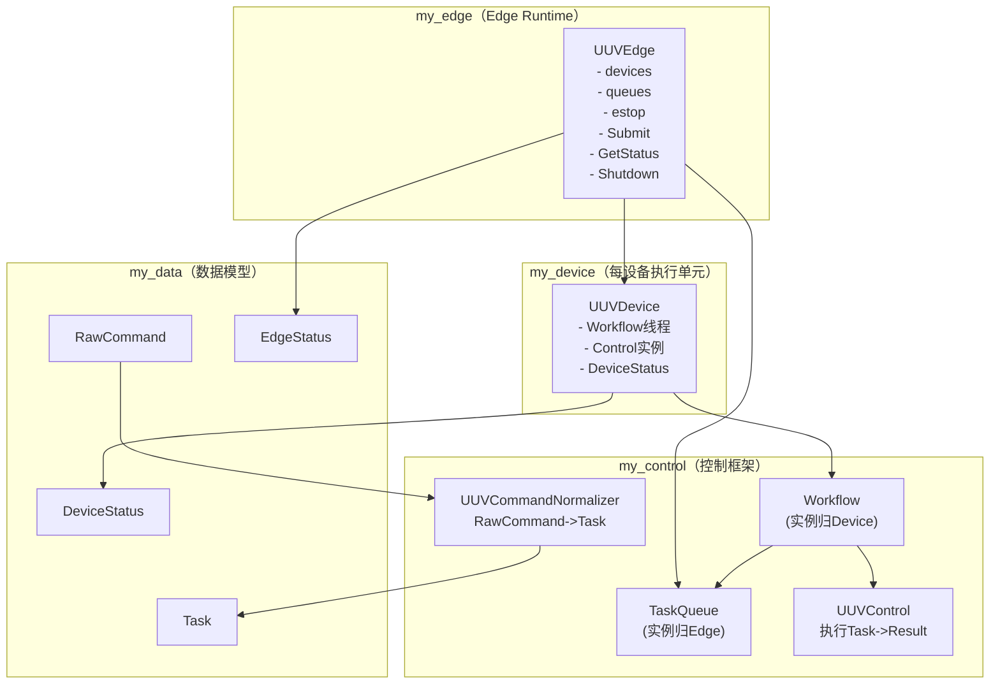
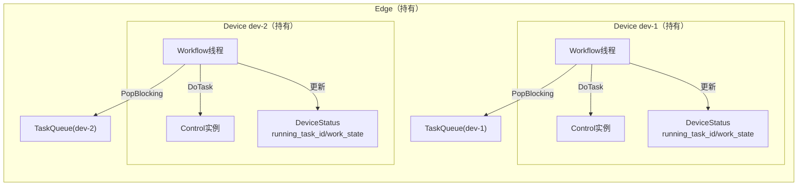
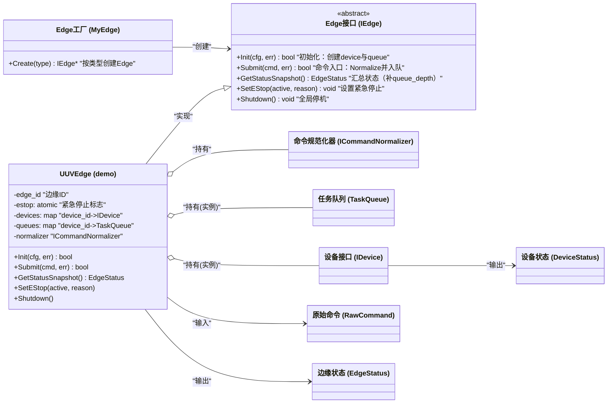
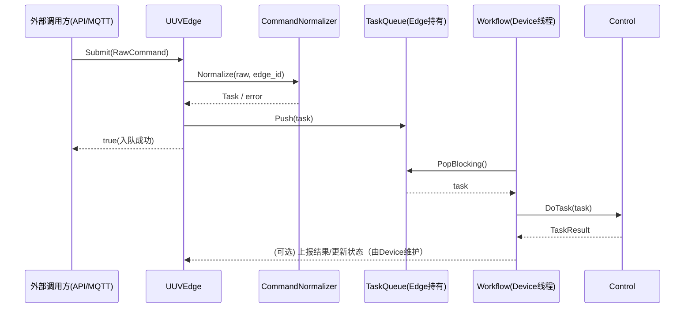
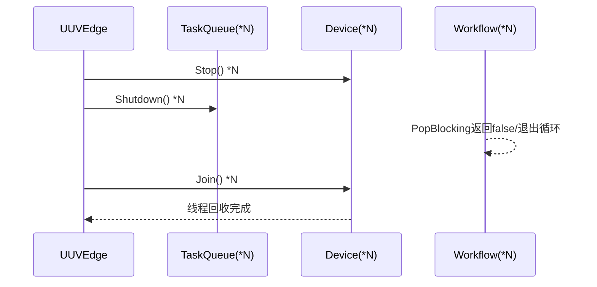

# my_edge 模块设计文档（评审版：Edge 作为队列与设备的统一管理者）

> 目标：实现 my_edge，使其成为单进程内的“边缘控制运行时（Edge Runtime）”：
> 统一管理 **设备实例（my_device）**、**队列实例（my_control::TaskQueue）**、**命令入口（RawCommand->Task）**、**状态汇总（EdgeStatus）**、**全局停机（shutdown/estop）**。
>
> 已确认约束（必须满足）：
>
> - 每个 device_id 一套：Device（内部含 Workflow+Control）
> - TaskQueue **实例归 Edge 持有**，Device 只拿引用消费
> - queue_depth 由 Edge 聚合填充更纯
> - 全局 shutdown 时由 Edge 统一 shutdown 全部队列
> - CommandNormalizer 在 my_control；Edge 仅负责选择并调用
> - 日志要求高：关键路径必须可观测（MYLOG_INFO/WARN/ERROR）

---

## 1. 模块定位与边界

### 1.1 my_edge 的定位

my_edge 是“运行时容器/编排器”，负责把以下模块拼起来：

- my_control：`ICommandNormalizer`、`TaskQueue`、（Workflow 在 Device 内使用）
- my_device：`IDevice`、具体设备（UUVDevice）
- my_data：`RawCommand/Task/Status/TaskResult`

它对外提供一个稳定的接口：

- `Init(config)`：按配置创建 device 与 queue，并启动 device
- `Submit(raw_command)`：规范化并路由到对应 device 队列
- `GetStatus()`：汇总 EdgeStatus（包含各设备状态 + 队列深度）
- `Shutdown()`：全局关闭（停止设备 + shutdown 队列 + join）

### 1.2 my_edge 不做什么

- 不处理网络接入（MQTT/TCP/REST 由其他模块负责）
- 不直接执行任务（执行由 Device->Workflow->Control 完成）
- 不做持久化/WAL（后续扩展）

---

## 2. 目录结构与文件职责（逐文件说明）

当前目录树：

```
src/util/my_edge
├── CMakeLists.txt
├── demo
│   ├── UUVEdge.cpp
│   └── UUVEdge.h
├── IEdge.h
├── MyEdge.cpp
└── MyEdge.h
```

### 2.1 `IEdge.h`

**定位：Edge 运行时接口（抽象）**

建议定义 my_edge 对外可用的核心能力：

- `bool Init(const nlohmann::json& cfg, std::string* err)`
- `bool Start(std::string* err)`（如果 Init 不自动启动）
- `bool Submit(const my_data::RawCommand& cmd, std::string* err)`
- `my_data::EdgeStatus GetStatusSnapshot() const`
- `void SetEStop(bool active, const std::string& reason)`
- `void Shutdown()`

> 说明：
>
> - “EStop” 作为全局策略变量放在 Edge 内（atomic`<bool>`）
> - Submit 只负责把任务放入正确队列；不阻塞等待执行

### 2.2 `MyEdge.h / MyEdge.cpp`

**定位：Edge 工厂/门面（轻量）**

与 my_control::MyControl、my_device::MyDevice 类似，MyEdge 可以做：

- `CreateEdge(type)`：根据 type 返回 demo/UUVEdge 或未来其他 Edge 类型
- 或者做 singleton 管理（与你其它模块一致）

建议 MyEdge 的职责：

- 创建具体 IEdge 实例
- 不直接包含业务逻辑（业务在 demo/UUVEdge）

### 2.3 `demo/UUVEdge.h / demo/UUVEdge.cpp`

**定位：UUV 场景的 Edge Runtime 实现（示例）**

UUVEdge 应当具备以下核心成员：

- `std::atomic<bool> estop_{false}` + `std::string estop_reason_`（mutex 保护 reason）
- `std::unordered_map<DeviceId, std::unique_ptr<IDevice>> devices_`
- `std::unordered_map<DeviceId, std::unique_ptr<TaskQueue>> queues_`
- normalizer 选择机制：
  - `std::unique_ptr<ICommandNormalizer> normalizer_`（简单：整个 Edge 统一一种 normalizer）
  - 或 `map<DeviceId, normalizer>`（复杂：不同设备不同 normalizer）
- 读写锁保护容器（推荐 `std::shared_mutex`）：
  - Submit/GetStatus 高频读
  - Init/Shutdown 写

并实现以下行为：

- `Init(cfg)`：按配置创建 queue + device，并启动 device（Start）
- `Submit(cmd)`：normalizer->task；查 task.device_id；找到 queue；push
- `GetStatusSnapshot()`：获取 EdgeStatus；遍历 devices 获取 DeviceStatus；并补 `queue_depth = queues_[id]->Size()`
- `Shutdown()`：先设置停止标志；停止 devices；统一 shutdown 全部 queue；join devices；清空容器

### 2.4 `CMakeLists.txt`

**定位：构建 my_edge 静态库**

依赖关系建议：

- my_edge 依赖：`my_device my_control my_data mylog myconfig pthread`
- include path：`${PROJECT_SOURCE_DIR}/src/util/my_edge`

---

## 3. 配置结构建议（nlohmann::json）

为了使 Init 可扩展，建议 cfg 使用类似结构：

```json
{
  "edge_id": "edge-1",
  "type": "uuv",
  "devices": [
    {
      "device_id": "uuv-1",
      "type": "uuv",
      "device_name": "UUV-ONE",
      "control": { "simulate_latency_ms": 50 }
    },
    {
      "device_id": "uuv-2",
      "type": "uuv",
      "device_name": "UUV-TWO",
      "control": { "simulate_latency_ms": 10 }
    }
  ]
}
```

说明：

- Edge 级字段：edge_id/type
- devices 为数组，便于扩展更多设备
- 每个 device 的 cfg 直接透传给 device->Init（Device 自己解析 control）

---

## 4. 核心职责分解（Edge 内部四条主线）

### 4.1 设备生命周期管理

- Create device instances（my_device::MyDevice::Create(type)）
- device->Init(device_cfg)
- device->Start(*queue, &estop_)
- 停机：device->Stop(); device->Join()

### 4.2 队列管理（每 device_id 一个）

- Create `TaskQueue("queue-"+device_id)`
- Submit 时按 device_id 查 queue->Push(task)
- Shutdown 时统一 queue->Shutdown()

### 4.3 命令入口与路由

- `Submit(RawCommand)`：
  1) 选择 normalizer（简单：Edge 持有一个 normalizer）
  2) `task = normalizer.Normalize(cmd, edge_id)`
  3) `device_id = task.device_id`
  4) 查 queues_[device_id]，不存在则返回 UnknownDevice
  5) Push(task)
- 返回：只表示“是否入队成功”；不代表执行成功

### 4.4 状态汇总

- `GetStatusSnapshot()` 返回 `my_data::EdgeStatus`
  - Edge 层字段：edge_id/run_state/boot_at_ms/estop_active/reason/version
  - devices 字段：从 device->GetStatusSnapshot() 获取，并补 queue_depth
  - tasks_pending_total：累加各队列 size
  - tasks_running_total：根据设备 work_state==Busy 统计

---

## 5. Edge 运行态模型（EdgeStatus）

建议 EdgeStatus 字段填写策略：

- `edge_id`：配置中读取
- `run_state`：
  - Init 前：Initializing
  - Start 后：Running
  - EStop：EStop
  - Degraded：后续扩展（部分设备故障）
- `boot_at_ms`：Init 时 NowMs
- `last_heartbeat_at_ms`：由 heartbeat 模块更新（或 Edge 内部记录）
- `estop_active`/`estop_reason`：Edge ��维护
- `devices`：device_id -> DeviceStatus（补 queue_depth）
- `tasks_pending_total`：sum(queue.size)
- `tasks_running_total`：count(device Busy)

---

## 6. 并发与锁设计（建议）

Edge 的典型并发访问场景：

- Submit（可能来自多线程：mqtt/api/other）
- GetStatus（heartbeat/api 频繁调用）
- Init/Shutdown（低频）

因此建议：

- `std::shared_mutex rw_mutex_`
  - Submit/GetStatus 使用 shared_lock
  - Init/Shutdown 使用 unique_lock

队列内部线程安全由 TaskQueue 自己保证，容器锁只保护 map 的结构与指针有效性。

---

## 7. 设计图（Mermaid，含中文注释）

### 7.1 模块协作图（Edge 作为容器）



### 7.2 per-device 一套队列与执行单元（实例级）



### 7.3 类图（含中文注释）



### 7.4 关键时序图：Submit（入队不等于执行成功）



### 7.5 停机时序：Edge 统一 shutdown 队列



---

## 8. 日志规范（建议）

Edge 至少记录以下关键日志（示例格式）：

- Init：
  - `MYLOG_INFO("[Edge:{}] Init 开始, cfg=...", edge_id)`
  - `MYLOG_INFO("[Edge:{}] 创建队列: device_id={}, queue_name={}", ...)`
  - `MYLOG_INFO("[Edge:{}] 创建设备: device_id={}, type={}", ...)`
  - `MYLOG_INFO("[Edge:{}] 启动设备成功: device_id={}", ...)`
- Submit：
  - `MYLOG_INFO("[Edge:{}] Submit: command_id={}, source={}", ...)`
  - `MYLOG_ERROR("[Edge:{}] Normalize失败: err={}, payload={}", ...)`
  - `MYLOG_ERROR("[Edge:{}] UnknownDevice: device_id={}", ...)`
  - `MYLOG_INFO("[Edge:{}] Push成功: device_id={}, task_id={}, queue_size={}", ...)`
- GetStatus：
  - `MYLOG_DEBUG("[Edge:{}] GetStatus: devices={}, pending_total={}, running_total={}", ...)`
- Shutdown：
  - `MYLOG_WARN("[Edge:{}] Shutdown: begin")`
  - `MYLOG_WARN("[Edge:{}] Shutdown: queue shutdown device_id={}", ...)`
  - `MYLOG_WARN("[Edge:{}] Shutdown: done")`

---

## 9. 评审确认项（请你确认后再编码）

1) Edge 的 `Init(cfg)` 是否 “Init 即启动 devices/workflows”？
   - 建议：是（Init 内部完成创建并 Start），简化上层使用
2) normalizer 是否 “整个 Edge 统一一种 normalizer（uuv）”？
   - 建议：是（demo 场景先统一），未来再 per-device/per-type 扩展
3) Submit 的返回语义：
   - true = 已入队；false = Normalize失败/找不到设备/队列shutdown
4) GetStatusSnapshot 是否需要携带 `version`（可从 cfg 或硬编码）？

---

如果你确认以上 4 点（或者给出你想要的差异），下一步我就按你的目录树开始贴 `my_edge` 的代码实现，并新增 gtest 用例到 `test/util/my_edge/demo/`，覆盖：

- Init 构建 N 个 device+queue
- Submit 能路由到正确队列并被设备执行（联动 my_device/my_control）
- Shutdown 能唤醒并回收所有 workflow
