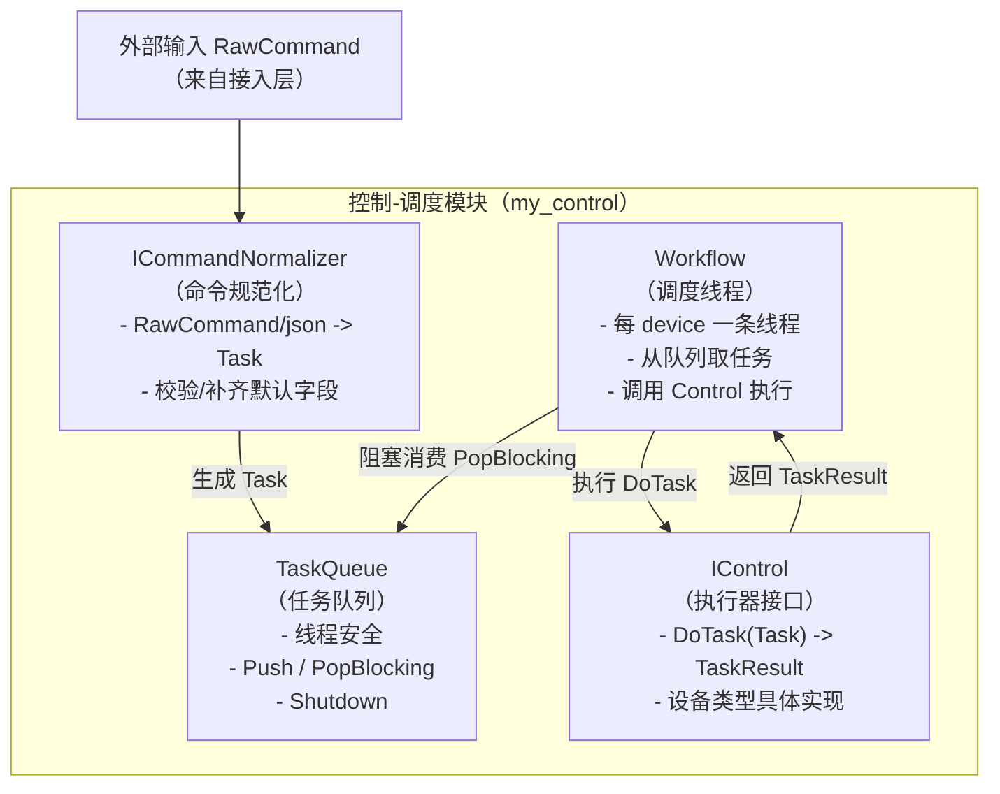
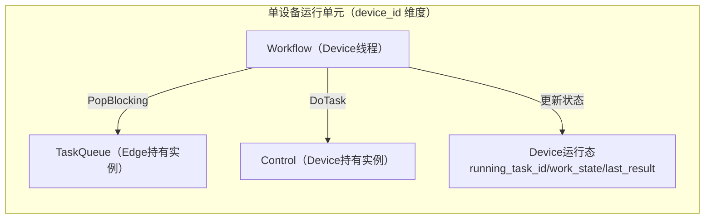
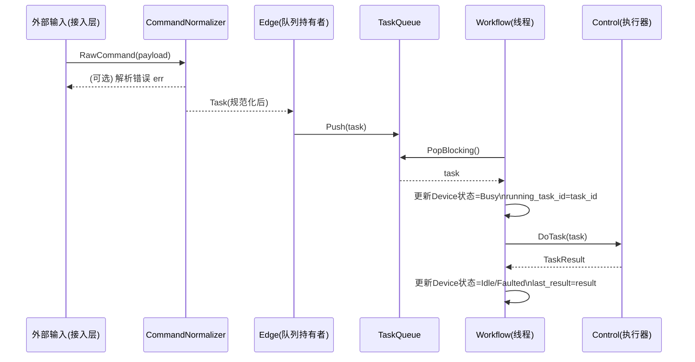
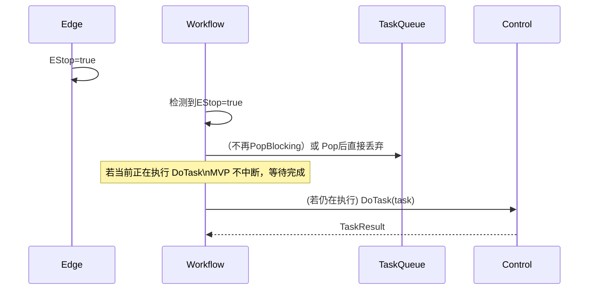
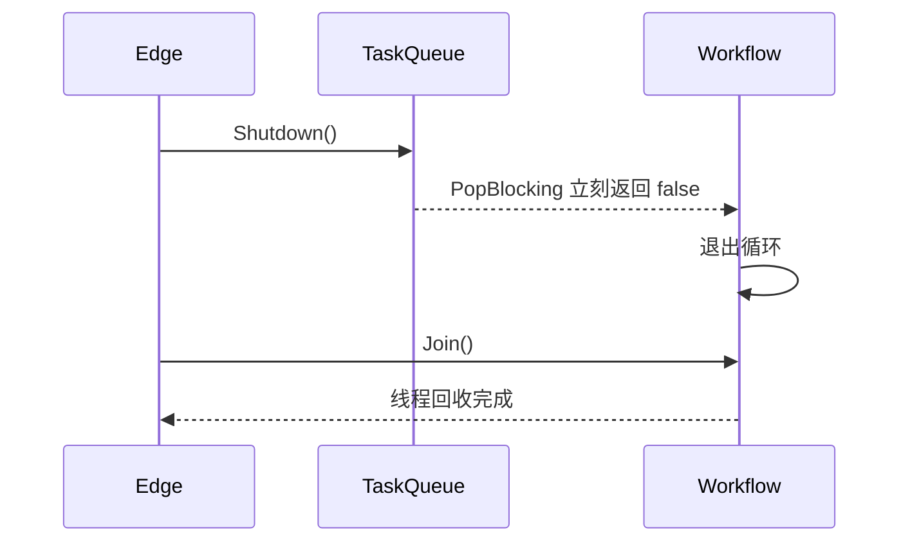
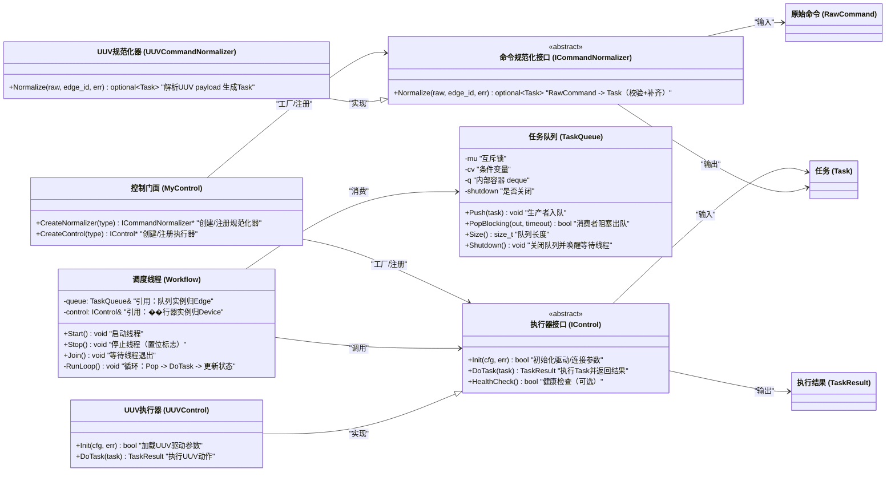

# 控制-调度模块（my_control + 关联 my_device 的运行模式）设计文档（评审版）

> 目标：在 **不引入复杂分布式/WAL/编排** 的前提下，完成一个 **稳定、清晰、可扩展** 的“控制-调度”模块设计。
> 本文刻意 **不涉及 Edge 的具体实现细节**（但会说明与 Edge 的接口契约），便于你先评审 my_control 的稳定性。
>
> 关键约束（已确认）：
>
> - **每个 device_id 一套**：`Workflow + Control`（在 Device 内运行）
> - **TaskQueue 的实例在 Edge**，Device/Workflow 只拿引用消费
> - my_data 已提供 `RawCommand/Task/TaskResult/Status/ErrorCode/Time/Id` 等数据类
> - TaskQueue 需要独立实现（不复用 `src/tools/thread_safe_queue`）
> - 命令规范化采用 `nlohmann::json`，并通过 `ICommandNormalizer` 抽象

---

## 1. 术语与范围

### 1.1 术语

- **RawCommand**：外部输入的原始控制命令（通常由 MQTT/TCP/REST 等接入层解析得到），在 my_data 中定义。
- **Task**：内部统一任务指令（capability/action/params + 运行态字段），在 my_data 中定义。
- **TaskResult**：任务执行结果（错误码、消息、输出、耗时），在 my_data 中定义。
- **CommandNormalizer**：将 RawCommand（或 payload json）转换为 Task 的组件。
- **TaskQueue**：线程安全队列；存放待执行的 Task；支持阻塞 pop 与 shutdown。
- **Workflow**：每 device 的调度线程；不断 pop Task 并调用 Control 执行。
- **Control**：执行器；理解设备能力域与动作；将 Task 转换成设备动作并返回 TaskResult。

### 1.2 本文范围（In-Scope）

- my_control 内：接口与组件设计`ICommandNormalizer / IControl / TaskQueue / Workflow`
- 与外部（Edge/Device）之间的 **接口契约** 与 **线程安全约束**（不实现 Edge）

### 1.3 非本文范围（Out-of-Scope）

- 分布式多实例、租约、WAL 恢复、跨设备编排
- MQTT/TCP/REST 接入与网络协议
- 真实设备驱动细节（仅以 demo UUV 为示例）

---

## 2. 总体架构（控制-调度闭环）

控制-调度闭环由四个核心部件组成：

1) **命令规范化（Normalize）**：`ICommandNormalizer`
2) **任务缓存（Queue）**：`TaskQueue`（实例归 Edge）
3) **调度执行（Schedule & Execute）**：`Workflow`（每设备线程）
4) **设备执行（Execute）**：`IControl`

### 2.1 架构总览图

---

## 3. 与外部模块的契约（不实现 Edge，但要定规则）

### 3.1 Queue 归属契约（已确认）

- **TaskQueue 实例由 Edge 创建并持有**
- Device 仅持有 **引用**（或指针）用于消费
- my_control 提供 TaskQueue 类型与其线程安全语义

### 3.2 Device 运行态契约（建议）

虽然本文不实现 my_device，但需要约定：

- Device 需要维护一个 **运行态状态快照**：
  - `running_task_id` / 可选 `running_task_snapshot`
  - `work_state`（Idle/Busy/Faulted）
  - `last_result` / `last_error`
- Workflow 执行时必须更新 Device 状态（通过回调或 Device 方法），避免 Control 直接改状态。

### 3.3 EStop 契约（最小语义）

- EStop 在 Edge 层触发（例如全局 atomic`<bool>`）
- Workflow 在每次取任务前检查 EStop：
  - 若 EStop=true：不再取新任务（或取出后直接返回 EStop 结果并丢弃）
- MVP 不要求中断正在执行的 DoTask（后续可扩展 Cancel）。

---

## 4. 组件详细设计

## 4.1 ICommandNormalizer（命令规范化）

### 4.1.1 职责

- 解析 `RawCommand.payload`（nlohmann::json）
- 校验必须字段
- 补齐 Task 的默认字段：
  - `task_id`：生成
  - `created_at_ms`：NowMs
  - `command_id`：若缺失则生成
  - `idempotency_key`：默认=command_id（**预留不启用**）
- 输出 `Task`（或失败原因）

### 4.1.2 输入输出

- 输入：`my_data::RawCommand` + `edge_id`
- 输出：`optional<Task>` + `err string`

### 4.1.3 校验规则（MVP）

- payload 必须是 object
- payload.device_id / capability / action 必须为 string
- params 若缺失则置空 `{}`

### 4.1.4 多类型设备支持（示例：UUV）

- `UUVCommandNormalizer` 实现 `ICommandNormalizer`
- 后续可新增：
  - `UAVCommandNormalizer`
  - `USVCommandNormalizer`
  - `DogBotCommandNormalizer`
- 选择策略（由外部装配决定，不在 my_control 强制）：
  - 按 device_type 映射 normalizer
  - 或按 device_id 映射 normalizer

---

## 4.2 TaskQueue（线程安全队列）

### 4.2.1 职责

- 缓存待执行 Task
- 支持跨线程：生产者（Edge）push，消费者（Workflow）pop
- 支持阻塞等待，避免 busy loop
- 支持 shutdown，便于进程优雅退出

### 4.2.2 最小接口（MVP）

- `Push(const Task&)`
- `PopBlocking(Task& out, int timeout_ms = -1) -> bool`
  - timeout_ms = -1 表示无限等待
  - shutdown 后返回 false
- `Size() -> size_t`
- `Shutdown()`

### 4.2.3 线程安全语义

- `Push` 与 `PopBlocking` 可并发
- `Shutdown` 会唤醒所有阻塞的 PopBlocking
- PopBlocking 返回 false 的含义：
  - timeout 到期（若支持 timeout）
  - 或队列 shutdown 且无数据可取

### 4.2.4 未来扩展点（不实现）

- 优先级队列（priority）
- removeByTaskId（取消）
- deadline 清理（超时丢弃）
- 限长与背压

---

## 4.3 Workflow（调度线程）

### 4.3.1 职责

- 绑定一个 device 的 `TaskQueue&` 与一个 `IControl&`
- 在独立线程中循环：
  1. 检查 `stop` / `shutdown`
  2. 若 EStop=true：暂停取任务或直接丢弃新任务
  3. `PopBlocking` 取 Task
  4. 更新 Device 运行态（Busy + running_task_id）
  5. 调用 `control.DoTask(task)`
  6. 更新 Device 运行态（Idle/Faulted + last_result）
  7. 可选：回调上报结果（给 Edge/上层）

### 4.3.2 输入输出

- 输入：TaskQueue 引用、IControl 引用、EStop 引用（可选）、状态回调（可选）
- 输出：通过回调输出 `(task, result)`，或由外部轮询状态快照

### 4.3.3 停机语义

- `Stop()`：设置停止标志 + 调用 queue.Shutdown()（或由 Edge 统一调用 Shutdown）
- `Join()`：等待线程退出
- 退出条件：stop=true 或 queue shutdown 且无任务

### 4.3.4 线程与状态一致性

- Workflow 是唯一的“执行线程”，可视为 device 的串行执行语义保障者
- Device 状态更新应该在 Workflow 线程完成，避免并发写导致状态撕裂

---

## 4.4 IControl（执行器接口）

### 4.4.1 职责

- 将 Task 映射到设备动作
- 执行并返回 TaskResult
- 不负责排队、不负责线程、不负责状态汇总

### 4.4.2 接口建议（MVP）

- `Init(cfg)`：加载连接参数/驱动参数
- `DoTask(task)`：同步执行并返回 TaskResult（MVP）
- `HealthCheck()`：可选

### 4.4.3 异步回调与同步返回（MVP策略）

- 对上（Workflow）：同步 `DoTask` 返回 TaskResult
- 对下（设备驱动）：允许异步回调，但 DoTask 内部可以等待回调完成（condition_variable）
- 后续升级：DoTaskAsync + EventBus（不在本文范围）

---

## 4.5 MyControl（装配与门面，建议保留但保持轻量）

### 4.5.1 职责

MyControl 的定位是“把 my_control 的组件组装起来，提供一个统一入口”，但由于你现在把 Queue 放到 Edge，MyControl 需要做到“轻量不越权”。

建议 MyControl 做两件事即可：

1. 提供创建 demo normalizer/control 的工厂（或注册表）
2. 提供一个 `Submit` 帮助函数（可选），但最终 push 队列仍在 Edge

> 即：MyControl 可以作为“框架容器”，但不直接持有 TaskQueue 实例（实例在 Edge）。

---

## 5. per-device 运行模型（你认可的模式）

### 5.1 per-device “一套三件套”概念

每个 device_id 绑定：

- 一个 `TaskQueue`（Edge 持有实例）
- 一个 `Workflow`（Device 内线程）
- 一个 `IControl`（Device 内执行器实例）

---

## 6. 关键数据流与时序（设计图）

## 6.1 正常执行时序（RawCommand -> Task -> 执行 -> Result）

## 6.2 EStop 影响时序（MVP：停止取新任务）

## 6.3 Shutdown 时序（建议）

---

## 7. 类图（含中文注释）

---

## 8. 设计原则与约束（为什么这样设计）

### 8.1 单一职责

- Normalizer：只做解析/校验/补齐
- Queue：只做线程安全缓存
- Workflow：只做调度与状态推进
- Control：只做执行

### 8.2 串行语义

- 每个 device_id 一条 Workflow 线程，天然保证单设备串行执行（避免同设备并发下发）

### 8.3 外部队列归属（Edge）

- 便于统一统计、限流、清空、未来 WAL/持久化
- Device 不拥有队列，降低耦合

### 8.4 可扩展性

未来扩展不破坏接口：

- 添加新设备类型：新增 `XxxCommandNormalizer`、`XxxControl`
- 添加优先级：升级 TaskQueue 内部结构
- 添加取消：扩展 TaskQueue 与 IControl
- 添加超时：Workflow 在 DoTask 周围加超时策略（或 Control 支持 cancel）

---

## 9. 风险点与约定（评审必须确认）

### 9.1 “每设备一线程”的规模问题

- 当前你明确要简单：每 device 一个 Workflow 线程是最直观方案。
- 未来设备数量大时，可演进为 “线程池 + per-device mailbox”，不影响现有接口，只替换 Workflow 实现。

### 9.2 状态一致性

- 约定：Device 状态只由 Workflow 线程写（或通过受控接口写），避免多线程写同一状态造成撕裂。

### 9.3 DoTask 阻塞风险

- MVP 可同步阻塞；但真实驱动可能卡死。未来要加入：
  - DoTask 超时保护
  - 驱动隔离线程/子进程（更高级）

---

## 10. 评审检查清单（你可以按此逐项确认）

1. Normalizer 输出 Task 的字段补齐是否足够（task_id/created_at/command_id/idempotency_key）
2. TaskQueue 的 shutdown 语义是否满足优雅退出
3. Workflow 的 stop/join 生命周期是否清晰
4. Control 与状态更新是否解耦（Control 不直接写 DeviceStatus）
5. EStop 的 MVP 语义是否接受（只停止取新任务，不中断正在执行）

---

如果你确认这份评审版设计没有问题，下一步你发起“开始编码”请求时，我会按你的目录树（含 demo 子目录）把 my_control 的代码骨架逐文件写出来，并与你现有 my_data 数据类与 test 框架对齐（包括新增 my_control 的 gtest 测试用例）。
