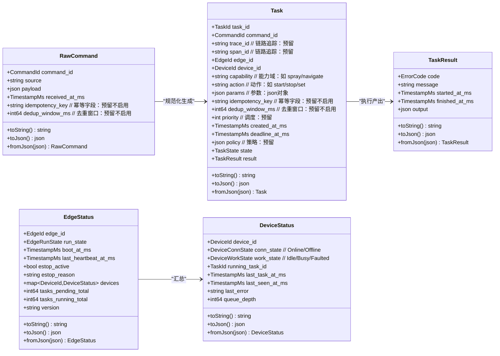

```mermaid
classDiagram
direction LR

class RawCommand {
  +CommandId command_id
  +string source
  +json payload
  +TimestampMs received_at_ms
  +string idempotency_key  // 幂等字段：预留不启用
  +int64 dedup_window_ms   // 去重窗口：预留不启用
  +toString() string
  +toJson() json
  +fromJson(json) RawCommand
}

class Task {
  +TaskId task_id
  +CommandId command_id
  +string trace_id         // 链路追踪：预留
  +string span_id          // 链路追踪：预留
  +EdgeId edge_id
  +DeviceId device_id
  +string capability       // 能力域：如 spray/navigate
  +string action           // 动作：如 start/stop/set
  +json params             // 参数：json对象
  +string idempotency_key  // 幂等字段：预留不启用
  +int64 dedup_window_ms   // 去重窗口：预留不启用
  +int priority            // 调度：预留
  +TimestampMs created_at_ms
  +TimestampMs deadline_at_ms
  +json policy             // 策略：预留
  +TaskState state
  +TaskResult result
  +toString() string
  +toJson() json
  +fromJson(json) Task
}

class TaskResult {
  +ErrorCode code
  +string message
  +TimestampMs started_at_ms
  +TimestampMs finished_at_ms
  +json output
  +toString() string
  +toJson() json
  +fromJson(json) TaskResult
}

class DeviceStatus {
  +DeviceId device_id
  +DeviceConnState conn_state  // Online/Offline
  +DeviceWorkState work_state  // Idle/Busy/Faulted
  +TaskId running_task_id
  +TimestampMs last_task_at_ms
  +TimestampMs last_seen_at_ms
  +string last_error
  +int64 queue_depth
  +toString() string
  +toJson() json
  +fromJson(json) DeviceStatus
}

class EdgeStatus {
  +EdgeId edge_id
  +EdgeRunState run_state
  +TimestampMs boot_at_ms
  +TimestampMs last_heartbeat_at_ms
  +bool estop_active
  +string estop_reason
  +map~DeviceId,DeviceStatus~ devices
  +int64 tasks_pending_total
  +int64 tasks_running_total
  +string version
  +toString() string
  +toJson() json
  +fromJson(json) EdgeStatus
}

RawCommand --> Task : "规范化生成"
Task --> TaskResult : "执行产出"
EdgeStatus --> DeviceStatus : "汇总"
```