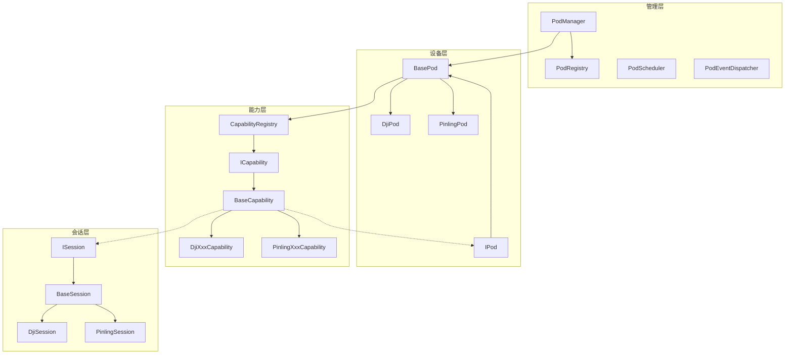
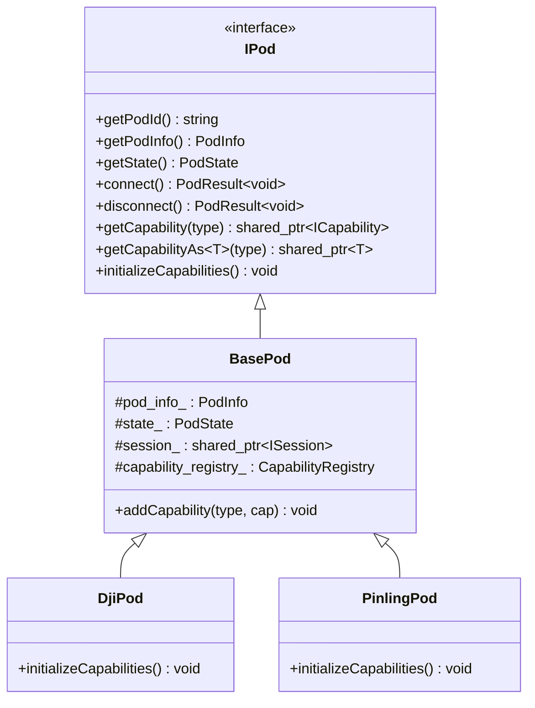
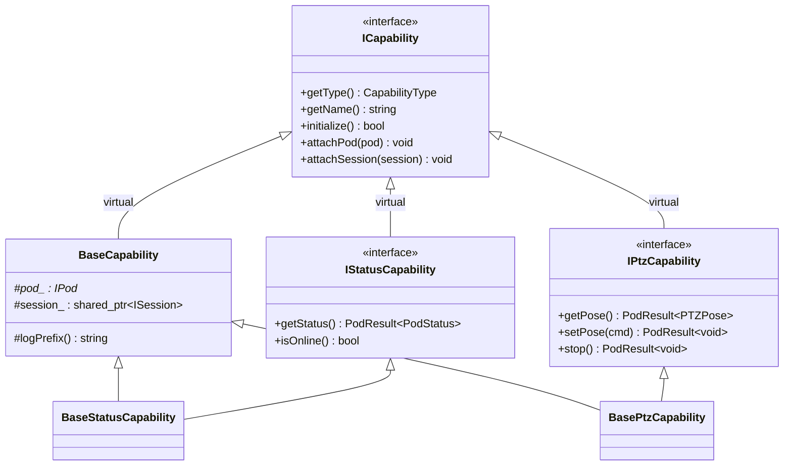
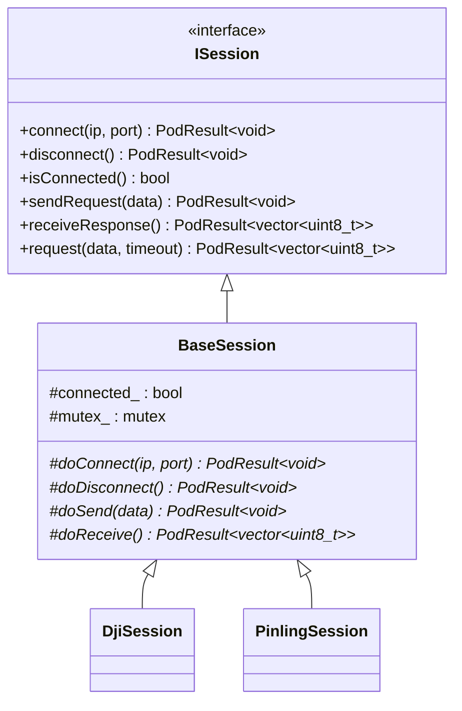

# 吊舱连接模块设计文档

## 1. 设计目标

- 提供多厂商吊舱设备统一接入框架
- 支持能力动态注册和查询
- 通信层解耦，Session 可独立扩展
- 厂商实现最小化，只需关注具体协议

## 2. 整体架构



## 3. 类关系

### 3.1 设备层



### 3.2 能力层



### 3.3 会话层



## 4. 能力注册机制

### 4.1 注册流程

```
DjiPod::initializeCapabilities()
    │
    ├─ auto status_cap = make_shared<DjiStatusCapability>()
    ├─ addCapability(CapabilityType::STATUS, status_cap)
    │       │
    │       ├─ capability_registry_.registerCapability(type, cap)
    │       ├─ cap->attachPod(this)          ← 自动关联设备
    │       └─ cap->attachSession(session_)  ← 自动关联会话
    │
    ├─ auto ptz_cap = make_shared<DjiPtzCapability>()
    ├─ addCapability(CapabilityType::PTZ, ptz_cap)
    │
    └─ ... (其余能力)
```

### 4.2 查询机制

```cpp
// 类型安全的能力查询
auto ptz = pod->getCapabilityAs<IPtzCapability>(CapabilityType::PTZ);
if (ptz) {
    // CapabilityRegistry 内部使用 unordered_map 存储
    // getCapabilityAs<T> 使用 dynamic_pointer_cast 进行安全转换
    ptz->setPose(cmd);
}
```

## 5. 虚继承与菱形继承

能力类存在菱形继承问题：

```
        ICapability
       /          \
BaseCapability   IStatusCapability
       \          /
    BaseStatusCapability
```

解决方案：`ICapability` 使用虚继承（`virtual public`），并在最终派生类中使用显式委托：

```cpp
class BaseStatusCapability : public BaseCapability, public virtual IStatusCapability {
public:
    // 显式委托到 BaseCapability 解决歧义
    void attachPod(IPod* pod) override { BaseCapability::attachPod(pod); }
    void attachSession(std::shared_ptr<ISession> session) override { BaseCapability::attachSession(session); }
};
```

## 6. 线程安全

- `BaseSession`: 通过 `std::mutex` 保护连接状态
- `PodManager`: 通过 `std::mutex` 保护设备注册表
- `PodRegistry`: 通过 `std::mutex` 保护注册/查询操作
- `PodEventDispatcher`: 通过 `std::mutex` 保护回调列表

## 7. 错误处理

使用 `PodResult<T>` 模板统一错误返回：

```cpp
// 成功
return PodResult<PodStatus>::success(status);

// 失败
return PodResult<void>::fail(PodErrorCode::CONNECTION_FAILED, "连接超时");

// 检查
auto result = pod->connect();
if (result.isSuccess()) { ... }
else { MYLOG_ERROR("错误: {}", result.getMessage()); }
```

## 8. 扩展指南

### 8.1 新增厂商（以 HikvisionPod 为例）

1. `session/hikvision/` — 实现 `HikvisionSession`
2. `capability/hikvision/` — 实现需要的能力
3. `pod/hikvision/` — 实现 `HikvisionPod`，在 `initializeCapabilities()` 中注册
4. 在 `common/pod_types.h` 中添加 `PodVendor::HIKVISION`

### 8.2 新增能力（以 RecordCapability 为例）

1. `common/capability_types.h` — 添加 `CapabilityType::RECORD`
2. `capability/interface/i_record_capability.h` — 定义接口
3. `capability/base/base_record_capability.h` — 实现基类
4. 各厂商目录下实现具体能力
